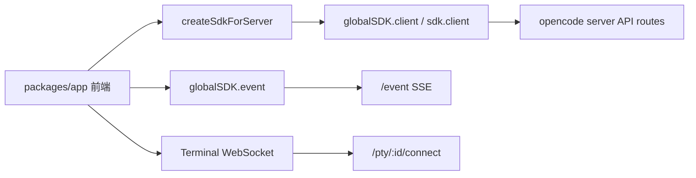

# opencode app 前端后台接口调用梳理

本文梳理 `packages/app` 这个 Web 前端会调用哪些后台能力、调用点在哪里、通常在什么时机触发。

先给结论：前端绝大多数请求不是手写 `fetch`，而是通过 `@opencode-ai/sdk/v2/client` 生成的 SDK 调用。SDK 实例在 `packages/app/src/utils/server.ts` 里创建，挂到 `GlobalSDKProvider` / `SDKProvider` 后，被页面和 context 使用。只有终端实时 IO 是单独走 WebSocket。

## 总体链路

服务端入口是 `packages/opencode/src/server/server.ts`。它把控制面、workspace、instance API、最后的 UI 静态页面都挂在同一个 Hono app 上，所以浏览器访问页面和页面调用 API 是同一个本地服务在处理。

## SDK 创建与作用域

`packages/app/src/utils/server.ts`

- `createSdkForServer({ server, directory, ... })` 创建 SDK client。
- `server.url` 作为 `baseUrl`。
- 如果服务有密码，会加 `Authorization: Basic ...`。
- 如果传了 `directory`，SDK 请求会带项目目录上下文，用于区分当前工作区。

`packages/app/src/context/global-sdk.tsx`

- 创建全局 SDK：`globalSDK.client`。
- 创建事件 SDK：`eventSdk.global.event(...)`。
- 对外提供 `globalSDK.createClient({ directory })`，让项目页面获得当前目录专用 client。

`packages/app/src/context/sdk.tsx`

- 在进入 `/:dir` 后，把 URL 中的目录解码出来。
- 基于全局 SDK 创建项目级 `sdk.client`。
- 项目页、session 页、文件页、终端页主要用这个 `sdk.client`。

## 启动与连接阶段

`packages/app/src/utils/server-health.ts`

- 调用：`global.health()`
- 时机：选择服务器、检查服务器可用性、连接状态轮询。
- 作用：确认 opencode server 是否健康，并读取版本。

`packages/app/src/context/server.tsx`

- 维护当前 server 连接，包括本地 sidecar、HTTP server、SSH server。
- 定时健康检查，默认约 10 秒一轮。
- 连接成功后，后续请求都会基于当前 server URL。

`packages/app/src/context/global-sdk.tsx`

- 调用：`global.event()`
- 时机：`GlobalSyncProvider` mount 后启动。
- 作用：建立 SSE 长连接，接收全局事件和项目事件。

## 全局数据初始化

主要在 `packages/app/src/context/global-sync/bootstrap.ts` 和 `packages/app/src/context/global-sync.tsx`。

`bootstrapGlobal(...)` 会并行加载：

- `global.config.get()`：读取全局配置。
- `provider.list()`：读取 Provider / Model 信息。
- `path.get()`：读取路径信息，如 home、当前目录、配置目录。
- `project.list()`：读取项目列表。

触发时机：

- `GlobalSyncProvider` 初始化时。
- 收到 `server.connected`、`global.disposed` 等全局事件后，可能触发刷新。
- 更新全局配置后会重新拉取。

配置更新：

- `global.config.update({ config })`
- 调用点：`globalSync.updateConfig(...)`
- 典型来源：设置页、Provider 禁用/启用等。

## 进入项目目录后的初始化

进入路由 `/:dir/session/:id?` 后，`DirectoryLayout` 会创建 `SDKProvider`、`SyncProvider` 等项目级上下文。

`bootstrapDirectory(...)` 会加载：

- `session.list(...)`：加载最近 session 列表。
- `app.agents()`：加载 Agent 列表。
- `config.get()`：读取当前目录配置。
- `session.status()`：读取 session 当前运行状态。
- `project.current()`：识别当前目录所属项目。
- `path.get()`：读取当前目录路径信息。
- `vcs.get()`：读取 Git/VCS 状态。
- `command.list()`：读取 slash command 列表。
- `permission.list()`：读取未处理权限请求。
- `question.list()`：读取未处理问题。
- `mcp.status()`：读取 MCP 状态。
- `provider.list()`：读取当前项目可用 Provider。

触发时机：

- 首次打开项目。
- 切换项目目录。
- 全局事件提示实例失效或需要刷新。
- 侧边栏需要预热某个项目/工作区数据。

## Session 列表与消息数据

主要在 `packages/app/src/context/sync.tsx`。

Session 列表：

- `session.list()`：加载当前目录 session。
- `globalSDK.client.session.list({ directory })`：跨目录加载 session，例如首页、项目切换、文件选择弹窗、侧边栏预取。

Session 详情：

- `session.get({ sessionID })`
- 时机：打开某个 session；预热未知 session；从 URL 或历史记录跳转到 session。

消息列表：

- `session.messages({ sessionID, limit, before })`
- 时机：打开 session 时加载最近消息。
- `before` 用于向上翻历史消息。
- 响应头 `x-next-cursor` 用作分页游标。

Session 附加数据：

- `session.diff({ sessionID })`：读取本 session 的文件 diff。
- `session.todo({ sessionID })`：读取 todo。
- `session.status()`：读取所有 session 运行状态。

## 发送 Prompt / 命令 / Shell

主要在 `packages/app/src/components/prompt-input/submit.ts`。

新 session：

- `worktree.create({ directory })`：如果用户选择新建 worktree，会先创建工作区。
- `session.create()`：创建 session。
- 成功后更新本地 store，并跳转到 `/:dir/session/:id`。

普通消息：

- `session.promptAsync({ sessionID, agent, model, messageID, parts, variant })`
- 时机：用户在输入框提交普通 prompt。
- 前端会先插入 optimistic message，再等 SSE 事件和后续消息同步修正状态。

Slash command：

- `session.command({ sessionID, command, arguments, agent, model, variant, parts })`
- 时机：输入以 `/xxx` 开头，并且 `command.list()` 中存在该命令。

Shell mode：

- `session.shell({ sessionID, agent, model, command })`
- 时机：输入框切换到 shell 模式后提交。

中断：

- `session.abort({ sessionID })`
- 时机：用户停止当前运行；或者 revert 前如果 session 正忙，会先 abort。

## Session 操作

分布在 `packages/app/src/pages/session.tsx`、`packages/app/src/pages/session/use-session-commands.tsx`、`packages/app/src/pages/session/message-timeline.tsx`、`packages/app/src/pages/layout.tsx`。

常见接口：

- `session.update({ sessionID, title })`：重命名 session。
- `session.update({ sessionID, time: { archived } })`：归档 session。
- `session.delete({ sessionID })`：删除 session。
- `session.share({ sessionID })`：分享 session。
- `session.unshare({ sessionID })`：取消分享。
- `session.revert({ sessionID, messageID })`：回滚到某条用户消息。
- `session.unrevert({ sessionID })`：取消回滚。
- `session.summarize({ sessionID, modelID, providerID })`：压缩上下文。

触发时机：

- Session header 菜单。
- Command palette。
- Timeline 上的消息操作。
- 回滚/恢复 dock。

## 文件与搜索

主要在 `packages/app/src/context/file.tsx`、`packages/app/src/components/dialog-select-directory.tsx`、`packages/app/src/components/dialog-select-file.tsx`。

文件树：

- `file.list({ path })`
- 时机：展开目录树、选择目录、刷新目录。

文件内容：

- `file.read({ path })`
- 时机：打开文件 tab、diff/review 中查看文件、文件 watcher 事件提示文件变化后重新读取。

文件搜索：

- `find.files({ query, dirs/type/limit })`
- 时机：选择文件、选择目录、输入 `@file` 或弹窗搜索。

文件状态：

- `file.status({ directory })`
- 时机：删除或重置 workspace 前检查是否有未提交/脏文件。

## 权限与问题

初始化加载在 `bootstrapDirectory(...)`：

- `permission.list()`
- `question.list()`

权限响应在 `packages/app/src/context/permission.tsx`：

- `permission.respond({ sessionID, permissionID, response, directory })`
- 时机：用户允许/拒绝工具调用；或者开启 auto accept 后自动响应。

权限自动接受：

- 开启目录级或 session 级 auto accept 后，会再调用 `permission.list({ directory })`，把已有待处理权限自动回复。

问题响应主要用于模型/工具向用户提问的场景，前端通过 SSE 发现 `question.asked`，并在 composer 相关 UI 中展示和回复。

## Provider / Auth / 设置

主要在 `packages/app/src/components/dialog-connect-provider.tsx`、`packages/app/src/components/settings-providers.tsx`、`packages/app/src/components/settings-general.tsx`。

Provider 信息：

- `provider.list()`：初始化和项目刷新时读取 Provider/Model。
- `provider.auth()`：打开连接 Provider 弹窗时读取支持的认证方式。

API Key：

- `auth.set({ providerID, auth: { type: "api", key } })`
- 时机：用户填写 API Key 后提交。

OAuth：

- `provider.oauth.authorize({ providerID, method, inputs })`
- `provider.oauth.callback({ providerID, method, code? })`
- 时机：用户选择 OAuth 方式后启动授权；手动输入 code 或自动等待 callback。

断开 Provider：

- `auth.remove({ providerID })`
- `global.dispose()`
- 时机：设置页断开 Provider 后，dispose 全局实例促使后端重载状态。

设置页还会调用：

- `pty.shells()`：读取可用 shell 列表。
- `global.config.update(...)`：保存全局设置，如 shell、disabled providers 等。

## Project / Workspace / Worktree

主要在 `packages/app/src/pages/layout.tsx`、`packages/app/src/pages/session.tsx`、`packages/app/src/components/dialog-edit-project.tsx`。

项目：

- `project.list()`：全局初始化读取项目列表。
- `project.current()`：进入目录后识别当前项目。
- `project.update({ projectID, directory, name })`：重命名项目。
- `project.initGit()`：在 session 页初始化 Git。

工作区 / worktree：

- `worktree.list({ directory })`：项目切换时刷新 worktree 列表。
- `worktree.create({ directory })`：新 session 时选择创建独立 workspace。
- `worktree.remove({ directory, worktreeRemoveInput })`：删除 workspace。
- `worktree.reset({ directory, worktreeResetInput })`：重置 workspace。
- `instance.dispose({ directory })`：重置 workspace 前释放该目录实例。

相关事件：

- `worktree.ready`
- `worktree.failed`

前端会用这些事件更新“workspace 正在准备/失败/完成”的本地状态。

## 终端 PTY

主要在 `packages/app/src/context/terminal.tsx`、`packages/app/src/components/terminal.tsx`、`packages/app/src/utils/terminal-websocket-url.ts`。

HTTP SDK 接口：

- `pty.create({ title })`：新建终端。
- `pty.update({ ptyID, title, size })`：改标题或同步终端尺寸。
- `pty.remove({ ptyID })`：关闭终端。
- `pty.get({ ptyID })`：重连前确认终端是否还存在。
- `pty.connectToken({ ptyID, directory })`：WebSocket 连接前取一次性 ticket。
- `pty.shells()`：设置页读取可用 shell。

WebSocket：

- URL 由 `terminalWebSocketURL(...)` 生成。
- 目标形态是 `/pty/:id/connect`。
- query 中会带 `directory`、`cursor`、`ticket`，远程 HTTP server 还可能带 `auth_token`。

触发时机：

- 打开终端 tab。
- 新建/克隆/关闭终端。
- xterm 尺寸变化。
- WebSocket 断线重连。

## SSE 事件驱动

`packages/app/src/context/global-sdk.tsx` 建立 `global.event()` 长连接后，会把事件分发为：

- `global` 事件：由 `applyGlobalEvent(...)` 更新全局项目/配置相关状态。
- 目录事件：由 `applyDirectoryEvent(...)` 更新某个 directory 的 session、message、permission、question、vcs、lsp、pty 等状态。

常见事件类型包括：

- `server.connected`
- `server.heartbeat`
- `global.disposed`
- `permission.asked`
- `question.asked`
- `session.updated`
- `session.status`
- `message.updated`
- `message.part.updated`
- `message.part.delta`
- `file.edited`
- `lsp.updated`
- `pty.exited`
- `worktree.ready`
- `worktree.failed`

这也是为什么很多 UI 不会在每次操作后立刻再手动拉全量数据：提交请求后，后端会继续通过 SSE 推状态变化，前端 reducer 把这些事件合并进本地 store。

## 和 Spring MVC 的类比

可以类比，但不是完全一样：

- `opencode web` 启动的是一个 Hono HTTP 服务。
- 这个服务既处理静态页面，又处理 API，又处理 SSE/WebSocket。
- 前端 SDK 调用相当于浏览器请求 controller endpoint。
- 服务端 routes 相当于 Spring MVC 的 controller 映射。

区别是：

- 前端和服务端都在同一个 TypeScript monorepo 里。
- API client 由 OpenAPI/SDK 生成，前端不需要手写 URL。
- 事件更新大量依赖 SSE，而不是每个页面自己轮询。
- 终端使用 WebSocket，不是普通 HTTP 请求。

## 读源码建议

如果只想顺着“页面打开到发消息”的主线读，可以按这个顺序：

1. `packages/app/src/entry.tsx`
2. `packages/app/src/app.tsx`
3. `packages/app/src/context/server.tsx`
4. `packages/app/src/context/global-sdk.tsx`
5. `packages/app/src/context/global-sync.tsx`
6. `packages/app/src/context/global-sync/bootstrap.ts`
7. `packages/app/src/context/sdk.tsx`
8. `packages/app/src/context/sync.tsx`
9. `packages/app/src/pages/session.tsx`
10. `packages/app/src/components/prompt-input/submit.ts`

如果想查某个 SDK 方法对应的服务端实现，可以从这些目录找：

- Hono 路由：`packages/opencode/src/server/routes/instance/*`
- 新 HttpApi 路由：`packages/opencode/src/server/routes/instance/httpapi/groups/*`
- 全局路由：`packages/opencode/src/server/routes/global.ts`
- SDK 生成入口：`packages/sdk/js`
